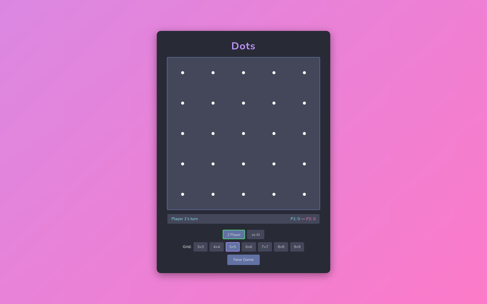

# Dots

A web-based version of the classic **Dots and Boxes** paper game, styled with the [Dracula](https://draculatheme.com/) color scheme.



## How to Play

Dots and Boxes is a two-player game played on a grid of dots:

1. Players take turns drawing a line between two adjacent dots (horizontally or vertically).
2. When a player completes the fourth side of a box, they claim that box and take another turn.
3. The game ends when all boxes are filled.
4. The player with the most boxes wins.

## Getting Started

No dependencies or build steps — just open the game in a browser:

```bash
# Option 1: open directly
open index.html

# Option 2: serve locally
python3 -m http.server 8000
# then visit http://localhost:8000
```

## Development Steps

1. **Project scaffolding** — Create `index.html`, `style.css`, and `game.js` with basic boilerplate and Dracula-themed page styling.
2. **Draw the dot grid** — Render an evenly spaced grid of dots on a canvas or using DOM elements.
3. **Line click detection** — Detect clicks/taps between adjacent dots and highlight the target line on hover.
4. **Place lines** — On click, draw a permanent line between two dots and record it in game state.
5. **Turn system** — Alternate turns between two players, displaying whose turn it is with player-specific colors.
6. **Box completion detection** — After each line is placed, check if it completes one or more boxes.
7. **Box claiming and bonus turn** — Fill completed boxes with the claiming player's color and grant them another turn.
8. **Scoreboard** — Display and update each player's score (number of claimed boxes) in real time.
9. **Game over and winner** — Detect when all boxes are filled, announce the winner (or draw), and disable further input.
10. **New game / restart** — Add a button to reset the board and start a fresh game.
11. **Grid size selection** — Allow players to choose different grid sizes (e.g. 3×3, 4×4, 5×5) before starting.
12. **AI opponent** — Add a single-player mode with a basic computer opponent.
13. **Polish and animations** — Add line-draw animations, box-fill transitions, and other visual polish.

## Tech

- Vanilla HTML5, CSS, and JavaScript
- Dracula color scheme throughout
- No frameworks or external dependencies

## License

[GPL-3.0](LICENSE)
